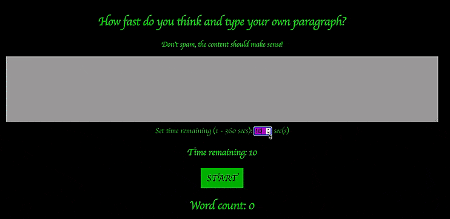

In the project directory, you can run:

### `yarn start` or `npm start`

Runs the app in the development mode.\
Open [http://localhost:3000](http://localhost:3000) to view it in the browser.

The page will reload if you make edits.\
You will also see any lint errors in the console.

### Demonstration

### Web links

The loading time is quite long but the website is definitely working, please be patience!

https://typing-game-testing.herokuapp.com/
